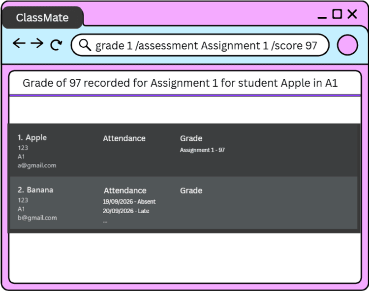

# ClassMates User Guide

ClassMates is a **desktop application for managing contacts, optimized for use through a Command Line Interface (CLI)** while retaining the benefits of a Graphical User Interface (GUI). If you type quickly, ClassMates can help you manage contacts faster than traditional GUI applications.

<!-- * Table of Contents -->
<page-nav-print />

--------------------------------------------------------------------------------------------------------------------

## Quick start

1. Ensure that Java `25` or later is installed on your computer. 
   **Mac users:** Ensure you have the precise JDK version prescribed [here](https://se-education.org/guides/tutorials/javaInstallationMac.html).

1. Download the latest `.jar` file from [here](https://github.com/se-edu/addressbook-level3/releases).

1. Copy the file to the folder you want to use as the _home folder_ for your ClassMates.

1. Open a terminal, `cd` to the folder containing the JAR file, and run `java -jar addressbook.jar`. 
   A GUI similar to the one below should appear in a few seconds. Note how the app contains some sample data. 
   

1. Type a command in the command box and press Enter to execute it. For example, type **`help`** and press Enter to open the help window. 
   Some example commands you can try:

   * `list` : Lists all contacts.

   * `list John` : Lists the contacts whose name, class or tags contain `John`.

   * `add /name John Doe /class A1 /email johnd@example.com` : Adds a contact named `John Doe` in class `A1` to the Address Book.

   * `delete 3` : Deletes the 3rd contact shown in the current list.

   * `delete /name John Doe /class A1` : Deletes the contact named `John Doe` in class `A1`.

   * `tag /group Group A /members 1,2` : Links the 1st and 2nd contacts shown in the current list to the group `Group A`.

   * `clear` : Deletes all contacts.

   * `exit` : Exits the app.

1. Refer to the [Features](#features) section below for details of each command.

--------------------------------------------------------------------------------------------------------------------

## Features

<box type="info" seamless>

**Notes about the command format:** 

* Words in `UPPER_CASE` are the parameters to be supplied by the user. 
  For example, in `add /name NAME`, replace `NAME` with a value such as `John Doe`.

* Each parameter is introduced by a prefix that starts with `/`, such as `/name`. 
  The prefix must be separated from the value, and from the preceding parameter, by a space. 
  For example, `/name John Doe` is valid, but `/nameJohn Doe` is not.

* Items in square brackets are optional. 
  For example, `/name NAME [/email EMAIL]` can be used as `/name John Doe /email johnd@example.com` or as `/name John Doe`.

* Items followed by `...` can appear zero or more times. 
  For example, `[/tag TAG]... ` may be omitted, or written as `/tag friend` or `/tag friend /tag family`.

* Parameters can be in any order. 
  For example, if the command specifies `/name NAME /class CLASS`, `/class CLASS /name NAME` is also acceptable.

* Extraneous parameters for commands that take no parameters, such as `help`, `exit`, and `clear`, are ignored. 
  For example, `help 123` is interpreted as `help`.

* If you are using a PDF version of this document, be careful when copying and pasting commands that span multiple lines as space characters surrounding line-breaks may be omitted when copied over to the application.
</box>

### Viewing help: `help`

Shows a message explaining how to access the help page.

Format: `help`

### Adding a person: `add`

Adds a person to the address book.

Format: `add /name NAME /class CLASS [/email EMAIL]`

* `NAME` must start with a letter and can be at most 80 characters long. It can only contain the English letters `A-Z` and `a-z`, spaces, and the characters `'`, `-`, `.` and `/`. A `/` must be between two letters, as in `Tan s/o Kumar`. Accented and non-English letters are not accepted.
* `CLASS` must start with a letter or a digit and can be at most 80 characters long. It can only contain the English letters `A-Z` and `a-z`, digits, spaces, and the characters `-`, `.` and `_`, as in `Sec 3-2` or `CS2103_T11`.
* A person is identified by their name and class together. The same name can be added to different classes, but not twice to the same class.
* Names and classes are compared ignoring case and extra spaces. For example, `john  tan` in class `a1` is treated as the same person as `John Tan` in class `A1`.
* The email is optional.
* Only `/name`, `/class` and `/email` are accepted, and each can be given at most once.

If the command cannot be carried out, ClassMates shows one of these messages:

Problem | Message
--------|--------
A parameter other than `/name`, `/class` or `/email` is given, such as `/phone` | `Unknown parameter. Use /name, /class or /email`
A parameter is given more than once | `Each parameter can only be specified once`
There is text before the first parameter, such as `add John /class A1` | `Invalid command format!` followed by the usage of `add`
`/name` is missing | `Command requires a name`
`/class` is missing | `Command requires a class`
The name is empty, too long or has characters that are not allowed | `Name cannot be empty`, `Name is too long` or a description of the allowed characters
The class is empty, too long or has characters that are not allowed | `Class name cannot be empty`, `Class name is too long` or a description of the allowed characters
The email is not valid, including `/email` with nothing after it | A description of the valid email format
The same name already exists in the same class | `NAME already exists in class CLASS`

If more than one problem applies, only the first one in the table above is reported. 
On success, ClassMates shows `NAME added to contacts`.

Examples:
* `add /name John Doe /class A1 /email johnd@example.com`
* `add /name Betsy Crowe /class A2`

### Listing and searching contacts: `list`

Shows a list of all contacts in the address book, or only the contacts that match a keyword.

Format: `list [KEYWORD]`

* If `KEYWORD` is omitted, all contacts are shown.
* If `KEYWORD` is given, only the contacts whose name, class or tags contain it are shown, and the message shows how many contacts were listed.
* The search is case-insensitive; for example, `john` matches `John`.
* Partial matches are included; for example, `jo` matches `John` and `2103` matches the class `CS2103`.
* The characters of `KEYWORD` must appear next to each other; for example, `ric` does not match the tag `friend`.
* A contact is shown if the keyword matches any one of their name, class or tags. Email is not searched.
* Everything after `list` is treated as one keyword, so it can contain several words, such as a full name or a class. Extra spaces are ignored; for example, `list John   Doe` is the same as `list John Doe`.
* A keyword with several words can match a name or a class, but not a tag, as tags are a single word.
* The keyword must match within a single field; for example, it cannot match the end of a name and the start of a class.
* The search always covers all contacts in the address book, even if a previous search is still displayed.
* If no contact matches, an empty list is shown.
* Contacts are currently shown in the order they were added.

Examples:
* `list` shows all contacts.
* `list John` shows `John Doe` and any contact in a class or with a tag containing `john`.
* `list CS2103` shows all contacts in a class containing `CS2103`.
* `list friend` shows all contacts with a tag containing `friend`.
* `list John Doe` shows contacts whose name or class contains `John Doe`.

### Editing a person: `edit`

Edits an existing person in the address book.

Format: `edit INDEX [n/NAME] [p/PHONE] [e/EMAIL] [a/ADDRESS] [t/TAG]... `

* Edits the person at the specified `INDEX`. The index refers to the index number shown in the displayed person list. The index **must be a positive integer** 1, 2, 3, ...
* At least one of the optional fields must be provided.
* Existing values will be updated to the input values.
* When editing tags, all of the person's existing tags are removed; adding tags is not cumulative.
* To remove all of a person's tags, enter `t/` without a tag after it.

Examples:
*  `edit 1 p/91234567 e/johndoe@example.com` Edits the phone number and email address of the 1st person to be `91234567` and `johndoe@example.com` respectively.
*  `edit 2 n/Betsy Crower t/` Edits the name of the 2nd person to be `Betsy Crower` and clears all existing tags.

### Locating persons by name: `find`

Finds persons whose names contain any of the given keywords.

Format: `find KEYWORD [MORE_KEYWORDS]`

* The search is case-insensitive; for example, `hans` matches `Hans`.
* Keyword order does not matter; for example, `Hans Bo` matches `Bo Hans`.
* The search considers only names.
* Only full words match; for example, `Han` does not match `Hans`.
* Persons matching at least one keyword are returned (an `OR` search); for example, `Hans Bo` returns `Hans Gruber` and `Bo Yang`.

Examples:
* `find John` returns `john` and `John Doe`
* `find alex david` returns `Alex Yeoh`, `David Li` 
  

### Deleting a person: `delete`

Deletes the specified person from the address book.

Format: `delete INDEX` or `delete /name NAME /class CLASS`

* `delete INDEX` deletes the person at the specified `INDEX`.
  * The index refers to the index number shown in the displayed person list.
  * The index **must be a positive integer** 1, 2, 3, ...
* `delete /name NAME /class CLASS` deletes the person with that name in that class.
  * Both the name and the class must match, because the same name can exist in different classes.
  * Case and extra spaces are ignored. For example, `john  tan` in class `a1` matches `John Tan` in class `A1`.
  * The whole address book is searched, even if only some persons are displayed, for example after a `find`.
  * The name and class are not checked against the rules for adding a person. If nothing matches, ClassMates shows `No contact found`.
* An index cannot be combined with `/name` or `/class` in the same command.
* On success, ClassMates shows `NAME in class CLASS has been deleted`, for example `Alex Yeoh in class A1 has been deleted`.

If the command cannot be carried out, ClassMates shows one of these messages:

Problem | Message
--------|--------
A parameter other than `/name` or `/class` is given, such as `/phone` | `Unknown parameter. Use /name or /class`
A parameter is given more than once | `Each parameter can only be specified once`
No index or parameters are given, the index is not a positive integer, or an index is combined with parameters | `Invalid command format!` followed by the usage of `delete`
`/name` is missing or has no value | `Command requires a name`
`/class` is missing or has no value | `Command requires a class`
No person has the given name and class | `No contact found`
The index is larger than the number of contacts displayed | `The contact index provided is invalid.`

If more than one problem applies, only the first one in the table above is reported.

Examples:
* `list` followed by `delete 2` deletes the 2nd person in the address book.
* `find Betsy` followed by `delete 1` deletes the 1st person in the results of the `find` command.
* `find Betsy` followed by `delete /name Alex Yeoh /class A1` deletes Alex Yeoh in class A1, even though Alex is not in the results of the `find` command.

### Linking contacts to a group: `tag`

Links one or more contacts to a group, so that you can tell which contacts belong together, such as the members of a team.

Format: `tag /group GROUP_NAME /members INDEX[,INDEX]...`

* `GROUP_NAME` must be 1 to 80 characters long. It can only contain the English letters `A-Z` and `a-z`, digits, spaces, hyphens and underscores, as in `Group A` or `team-1_alpha`.
* Spaces at the start and end of `GROUP_NAME` are ignored, and repeated spaces inside it are treated as a single space.
* Group names are compared ignoring case, so `Group A` and `group  a` are the same group. Each contact shows the group name as you typed it when you linked that contact.
* `INDEX` refers to the index number shown in the displayed contact list, so after a command such as `find`, it refers to the contacts in the results. Each index **must be a positive integer** 1, 2, 3, ...
* The indices are separated by commas, and spaces around a comma are ignored, so `1,3,5` and `1, 3, 5` are the same. A comma at the start or end, or two commas in a row, is not allowed, and each index can be given only once.
* The group is shown as a label on each linked contact, in alphabetical order ignoring case.
* A contact can be in several groups, but cannot be linked to the same group twice.
* The command is all or nothing. If any problem is found, none of the contacts are linked.
* Only `/group` and `/members` are accepted, and each can be given at most once.

If the command cannot be carried out, ClassMates shows one of these messages:

Problem | Message
--------|--------
A parameter other than `/group` or `/members` is given, such as `/name` | `Unknown parameter. Use /group or /members`
A parameter is given more than once | `Each parameter can only be specified once`
There is text before the first parameter, such as `tag GroupA 1 3` | `Invalid command format!` followed by the usage of `tag`
`/group` is missing or has nothing after it | `Missing group name`
`/members` is missing or has nothing after it | `Missing members`
The group name is empty, too long or has characters that are not allowed | `Invalid group name.` followed by a description of the allowed characters
An entry in `/members` is empty, such as in `1,,3` or `1,3,` | `Members cannot contain empty entries`
An entry in `/members` is not a positive integer, such as `0`, `-1`, `abc` or `1 3` | `Contact index must be a positive integer: ENTRY`
The same index is given more than once | `Duplicate contact index: INDEX`
An index does not match a contact in the displayed list | `Contact index not found: INDEX`
One or more of the contacts are already in the group | `One or more contacts are already in this group: NAME (CLASS)`

If more than one problem applies, only the first one in the table above is reported. 
If several indices are repeated or not found, or several contacts are already in the group, all of them are listed in the message, separated by commas. 
On success, ClassMates shows `Contacts successfully linked to group GROUP_NAME:` followed by the name and class of each linked contact, in the order that the indices were given.

Examples:
* `tag /group Group A /members 1,3,5` links the 1st, 3rd and 5th contacts in the displayed list to `Group A`.
* `find Betsy` followed by `tag /group Team 2 /members 1` links the 1st contact in the results of the `find` command to `Team 2`.

### Clearing all entries: `clear`

Clears all entries from the address book.

Format: `clear`

### Exiting the program: `exit`

Exits the program.

Format: `exit`

### Saving the data

ClassMates automatically saves data after every command. You do not need to save manually.

### Editing the data file

ClassMates data is saved automatically as a JSON file `[JAR file location]/data/addressbook.json`. Advanced users are welcome to update data directly by editing that data file.

<box type="warning" seamless>

**Caution:**
If your changes make the data file invalid, ClassMates starts with an empty address book at the next run. The invalid file remains on disk until you run a command (ClassMates saves after every command). Still, we recommend backing up the file before editing it. 
Data files from earlier versions of ClassMates, which do not record a class for each person, are also treated as invalid. 
Furthermore, certain edits can cause ClassMates to behave in unexpected ways (e.g., if a value entered is outside of the acceptable range). Therefore, edit the data file only if you are confident that you can update it correctly.
</box>

### Archiving data files `[coming in v2.0]`

_Details coming soon ..._

--------------------------------------------------------------------------------------------------------------------

## FAQ

**Q**: How do I transfer my data to another computer? 
**A**: Install the app on the other computer and overwrite the data file it creates with the data file from your previous ClassMates home folder.

--------------------------------------------------------------------------------------------------------------------

## Known issues

1. **When using multiple screens**, if you move the application to a secondary screen, and later switch to using only the primary screen, the GUI will open off-screen. The remedy is to delete the `preferences.json` file created by the application before running the application again.
2. **If you minimize the Help Window** and then run the `help` command (or use the `Help` menu, or the keyboard shortcut `F1`) again, the original Help Window will remain minimized, and no new Help Window will appear. The remedy is to manually restore the minimized Help Window.

--------------------------------------------------------------------------------------------------------------------

## Command summary

Action     | Format, Examples
-----------|----------------------------------------------------------------------------------------------------------------------------------------------------------------------
**Add**    | `add /name NAME /class CLASS [/email EMAIL]`   e.g., `add /name James Ho /class A1 /email jamesho@example.com`
**Clear**  | `clear`
**Delete** | `delete INDEX` or `delete /name NAME /class CLASS`  e.g., `delete 3`, `delete /name John Tan /class A1`
**Edit**   | `edit INDEX [n/NAME] [p/PHONE_NUMBER] [e/EMAIL] [a/ADDRESS] [t/TAG]... `  e.g.,`edit 2 n/James Lee e/jameslee@example.com`
**Find**   | `find KEYWORD [MORE_KEYWORDS]`  e.g., `find James Jake`
**Tag**    | `tag /group GROUP_NAME /members INDEX[,INDEX]...`  e.g., `tag /group Group A /members 1,3,5`
**List**   | `list [KEYWORD]`  e.g., `list John`
**Help**   | `help`
